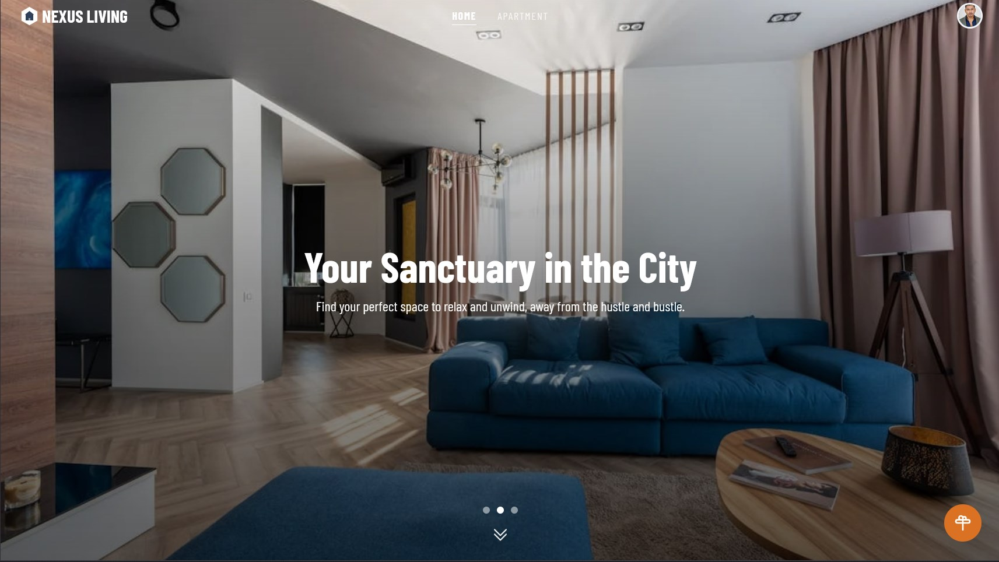
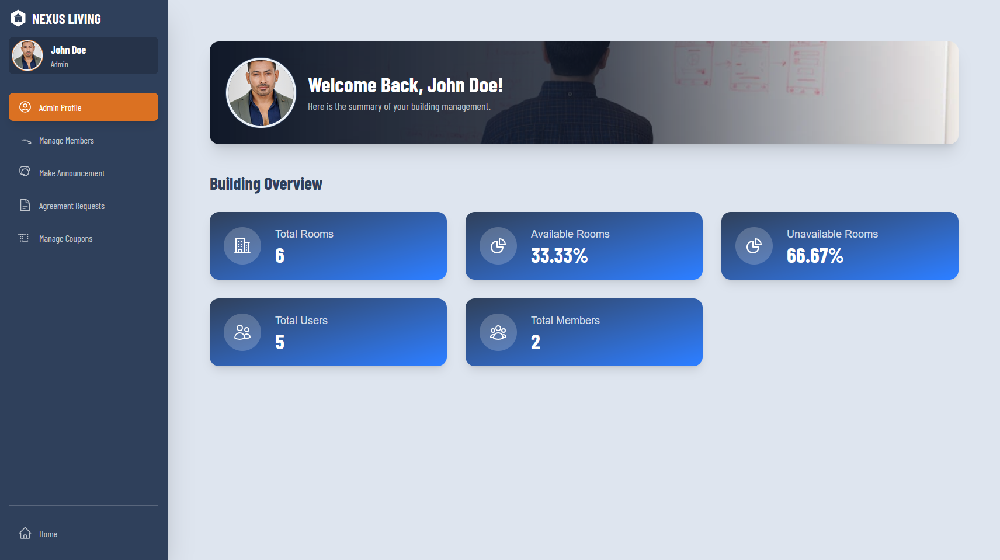
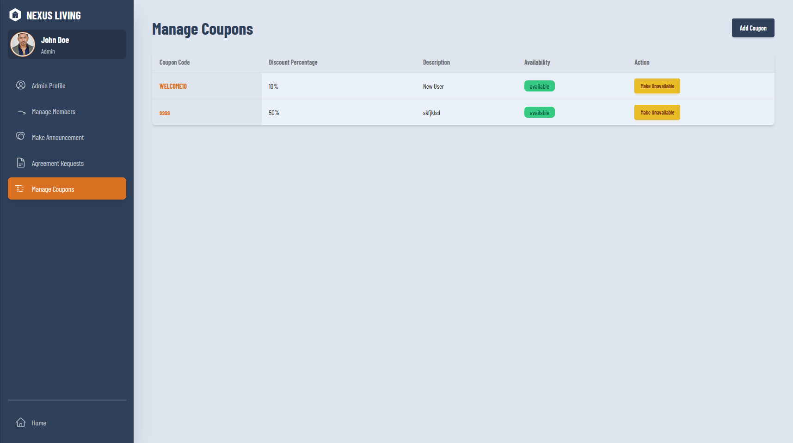

# Nexus Living - Building Management System

Nexus Living is a full-stack web application designed to streamline the management of a residential building. It provides distinct dashboard experiences for residents, members (tenants with agreements), and administrators, facilitating everything from apartment hunting to rent payments and community announcements.

**Live URL:** [https://nexus-living.web.app](https://nexus-living.web.app)

**GitHub Repositories:**
- **Client-Side:** [https://github.com/Programming-Hero-Web-Course4/b11a12-client-side-siam-sk](https://github.com/Programming-Hero-Web-Course4/b11a12-client-side-siam-sk)
- **Server-Side:** [https://github.com/Programming-Hero-Web-Course4/b11a12-server-side-siam-sk](https://github.com/Programming-Hero-Web-Course4/b11a12-server-side-siam-sk)

---

## Key Features

- **Role-Based Access Control:**
    - **Guests:** Can browse available apartments.
    - **Users:** Registered users can request to rent an apartment by making an agreement.
    - **Members:** Logged-in tenants with an active agreement can make payments, view payment history, and see announcements.
    - **Admin:** Manages the entire system, including user roles, apartment listings, agreement requests, coupons, and announcements.

- **Secure Authentication:**
    - JWT-based authentication using Firebase for both email/password and Google social login.
    - Secure middleware on the backend to protect routes based on user roles.

- **Interactive Dashboards:**
    - **Admin Dashboard:** Displays key statistics (room availability, user counts), and provides tools to manage members, handle agreement requests, create/manage coupons, and post announcements.
    - **Member Dashboard:** Allows members to view their profile, make rent payments (with coupon support), and view their complete payment history.
    - **User Dashboard:** A basic view for registered users to manage their profile and see announcements.

- **Apartment & Agreement System:**
    - Publicly viewable list of apartments with pagination and rent-range filtering.
    - Users can submit an agreement request for an apartment (one per user).
    - Admins can accept or reject agreement requests, which automatically updates the user's role and the room's availability.

- **Payment & Coupon System:**
    - Members can make monthly rent payments through a secure payment gateway.
    - A dynamic coupon system allows admins to create and manage discount coupons.
    - Members can apply valid coupons at checkout to receive a discount on their rent.

---

## Project Showcase

<table>
  <tr>
    <td align="center"><strong>Home Page</strong></td>
  </tr>
  <tr>
    <td></td>
  </tr>
  <tr>
    <td align="center"><strong>Admin Dashboard</strong></td>
  </tr>
  <tr>
    <td></td>
  </tr>
   <tr>
    <td align="center"><strong>Coupon Page</strong></td>
  </tr>
  <tr>
    <td></td>
  </tr>
</table>

---

## Technology Stack & Key Packages

This project is built with the MERN stack and utilizes several modern libraries for a robust and efficient user experience.

### Frontend (`a12-bms-client`)

- **Framework:** React
- **Routing:** React Router
- **Styling:** Tailwind CSS with daisyUI component library
- **State Management:** TanStack Query (for server state management and caching)
- **HTTP Client:** Axios (with interceptors for JWT handling)
- **Authentication:** Firebase (Client SDK)
- **Forms:** React Hook Form
- **Notifications:** SweetAlert2 & React Hot Toast
- **Mapping:** Leaflet & React-Leaflet

### Backend (`a12-bms-server`)

- **Runtime:** Node.js
- **Framework:** Express.js
- **Database:** MongoDB
- **Authentication:** Firebase Admin SDK (for JWT verification)
- **Deployment:** Vercel

---

## Getting Started & Deployment

### Prerequisites

- Node.js and npm
- MongoDB account
- Firebase project

### 1. Local Server Setup

```bash
# Navigate to the server directory
cd a12-bms-server

# Install dependencies
npm install

# Create a .env file with your database credentials
# DB_USER=your_mongodb_user
# DB_PASS=your_mongodb_password

# Place your firebase-service-account.json file in the root of the server directory.

# Start the server
npm start
```

### 2. Local Client Setup

```bash
# Navigate to the client directory
cd a12-bms-client

# Install dependencies
npm install

# Create a .env.local file with your Firebase client configuration
# VITE_API_KEY=...
# VITE_AUTH_DOMAIN=...
# VITE_PROJECT_ID=...
# VITE_STORAGE_BUCKET=...
# VITE_MESSAGING_SENDER_ID=...
# VITE_APP_ID=...
# VITE_API_URL=http://localhost:5000

# Start the client development server
npm run dev
```

### 3. Deployment

- The **frontend** is deployed on **Firebase Hosting**.
- The **backend** is deployed on **Vercel**.

**Vercel Environment Variables:**
- `DB_USER`: Your MongoDB username.
- `DB_PASS`: Your MongoDB password.
- `SERVICE_ACCOUNT_JSON`: The complete JSON content from your Firebase service account file.

**Post-Deployment Configuration:**
1.  Add the deployed Vercel server URL to the `cors` options in `index.js`.
2.  Add the deployed Vercel server URL to the **Authorized domains** in your Firebase Authentication settings.
3.  Create a `.env.production` file in the client directory with `VITE_API_URL` pointing to your Vercel server URL before building
